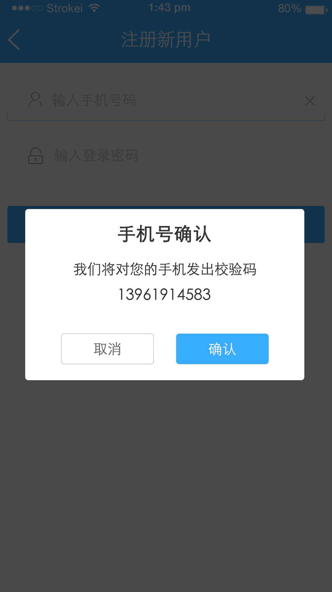

# 项目中遇到的一个弹框
###如下图所示



##使用方法

```objc
// 在按钮的方法中调用
- (void)showAlertViewController {
    
    NSAttributedString *subTitle = [[NSAttributedString alloc] initWithString:@"我们将对您的手机发出校验码"];
    NSAttributedString *detail = [[NSAttributedString alloc] initWithString:@"13812341234"];
    
    HQAlertViewController *alertVC = [HQAlertViewController alertWithTitle:@"手机号确认"
                                                                  subTitle:subTitle
                                                               detailTitle:detail
                                                         cancelButtonTitle:@"取消"
                                                           sureButtonTitle:@"确认"];
    alertVC.sureButtonBackgroundColor = [UIColor blueColor];
    [alertVC setSurenButtonClickBlock:^(UIButton *sureBtn) {
        NSLog(@"确认按钮被点击了");
    }];
    // 此处的self 为当前控制器
    [alertVC showWithPresentViewController:self];
}


```
##  安装
### 1.手动添加:<br>
*   1.将 HQAlertViewController 文件夹添加到工程目录中<br>
*   2.导入 HQAlertViewController.h

### 2.CocoaPods:<br>
*   1.在 Podfile 中添加 pod 'HQAlertViewController'<br>
*   2.执行 pod install 或 pod update<br>
*   3.导入 HQAlertViewController.h

##  Tips
*   1.如果发现pod search XHWebImageAutoSize 搜索出来的不是最新版本，需要在终端执行cd ~/desktop退回到desktop，然后执行pod setup命令更新本地spec缓存（需要几分钟），然后再搜索就可以了
*   2.如果你发现你执行pod install后,导入的不是最新版本,请删除Podfile.lock文件,在执行一次 pod install
*   3.如果在使用过程中遇到BUG，希望你能Issues我，谢谢（或者尝试下载最新的代码看看BUG修复没有）

##  系统要求
*   该项目最低支持 iOS 7.0 和 Xcode 7.0

##  许可证
HQAlertViewController 使用 MIT 许可证，详情见 LICENSE 文件

